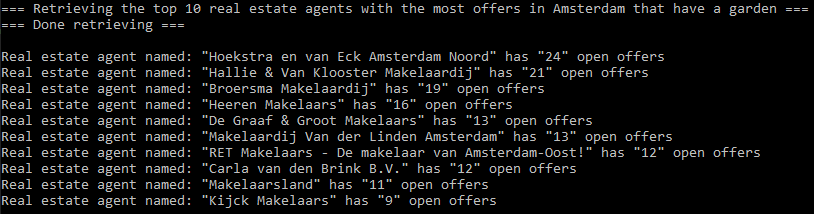

# Readme

## Introduction

This application was created to return the top 10 real estate agents (based on the most offers), that are selling houses with a garden in Amsterdam.
The application uses a console app that calls a funda api and returns the top 10.
The output will look something like this:



## Structure

The project is structured as follows

```
src
|_ Abstractions
   Has objects that match the funda api returned json, 
|_ Api
   A console app which calls the domain layer
|_ Domain
   The layer that is responsible for creating the real estate agents and return information as requested.
|_ Domain.Test.Unit
   Project responsible for testing the domain layer
|_ Infrastructure
   The layer that is responsible for talking to the funda API.
|_ Infrastructure.Test.Unit
   Project responsible for testing the infrastructure layer
```

**IRepository**\
I created the `IRepository` interface in the domain layer, because I want to be able to switch the infrastructure layer from for example the funda API to an actual database, without having the change my domain layer. The domain layer expects that it can make a certain call to the infrastructure layer, but does not care what actually happens there.
Now that the `IRepository` interface is in the domain layer, any change in the infrastructure will still need to match that interface.

## How to use

This project can be run by opening the project in visual studio and pressing F5.
The tests can be run using the test explorer.

> Note: This is a .net 5.0 application, so you will need to have the .net 5.0 sdk installed to run this application
